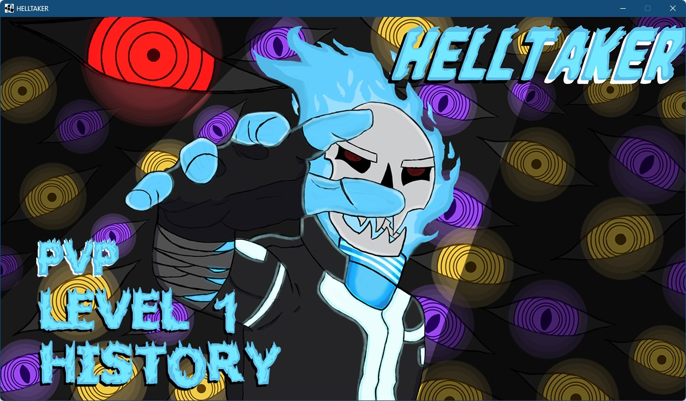
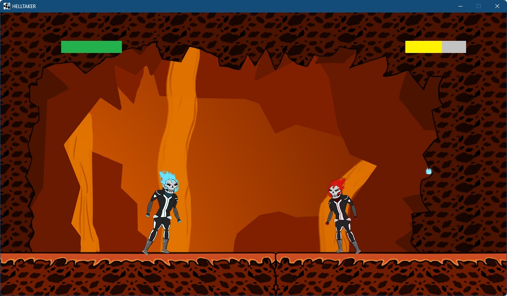
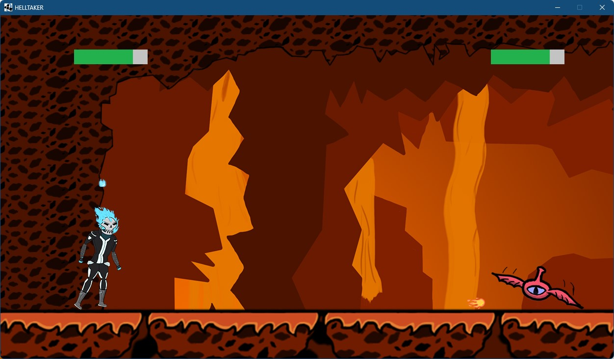
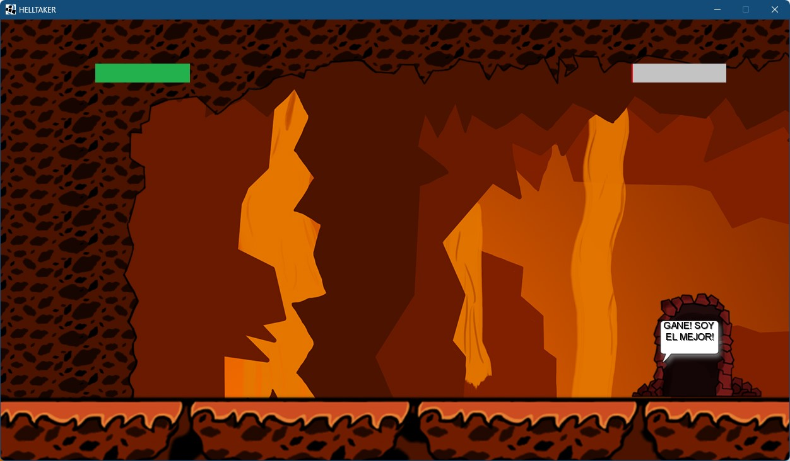

# HELLTAKER

## Equipo de desarrollo

- CALBI MATTEO
- LLANOS EMANUEL
- PALMIERI CIRO
- PEDACI MARCOS
- PICCININNO FRANCO 

## Capturas

### Menu del juego

### Modo PVP

### Modo Historia

### Fin del juego

## Reglas de Juego

### Objetivo
El objetivo del juego es derrotar a todos los jefes que te aparezcan e ir avanzado en cada nivel

## Instrucciones
### Menu
Return ==> Salir del juego\
Enter ==> Seleccionar modo de juego\
↓ s ↑ w ==> Moverse entre botones

### Modo PVP
#### Jugador Izquierda
a ==> Moverse a la izquierda\
d ==> Moverse a la derecha\
s ==> Disparar\
space ==> Saltar

#### Jugador Derecha
← ==> Moverse a la izquierda\
→ ==> Moverse a la derecha\
control ==> Disparar\
↑ ==> Saltar

### Modo Historia
a ==> Moverse a la izquierda\
d ==> Moverse a la derecha\
s ==> Disparar\
space ==> Saltar

## Otros

- K2004 / UTN FRBA
- Versión de wollok 3.0.0
- Una vez terminado, no tenemos problemas en que el repositorio sea público
